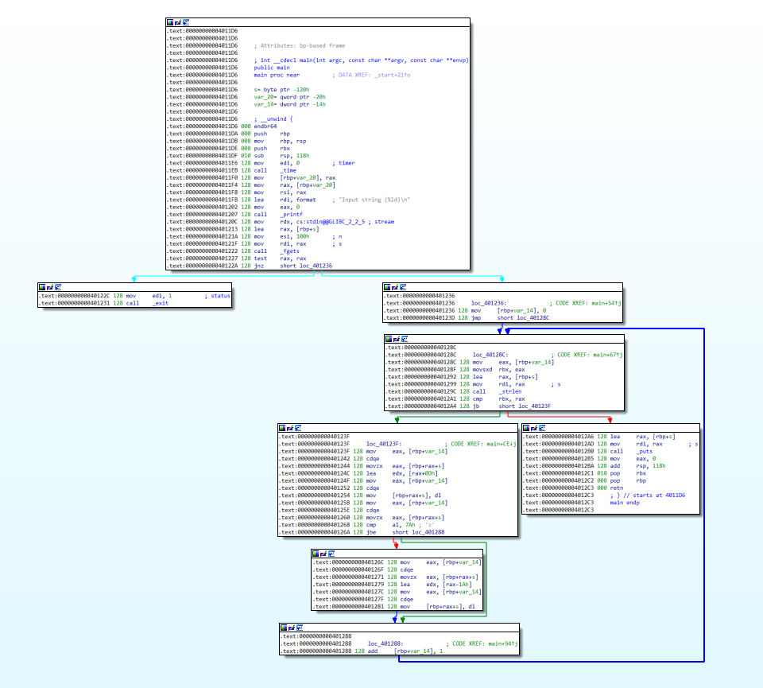
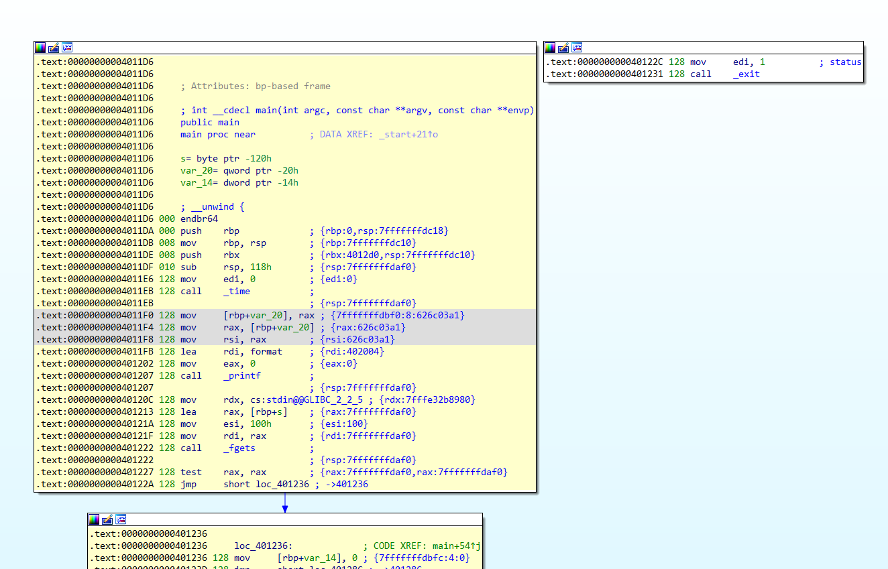
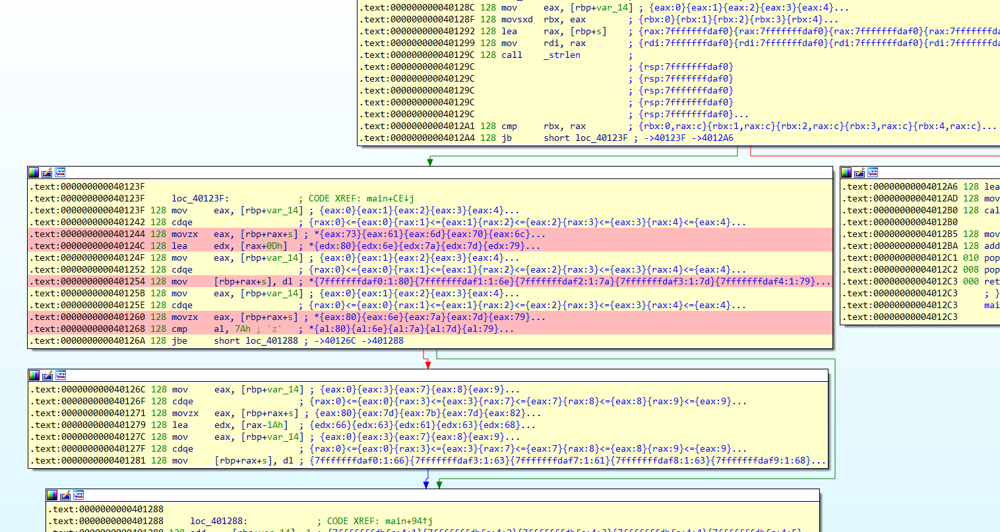

## Pintr to IDA

This is a plugin for Hex-Ray's IDA Pro disassembler to map [pintr](https://github.com/hada2/pintr) trace log to IDA-View.

### Features

* Put trace log on the corresponding instruction as the comment.

* Set color on the instructions according to the execution result.
  * Yellow indicates that the value doesn't change depending on the input values.
  * Gray indicates that the value changes each time when it is executed.
  * Red indicates that the value changes depending on the input value.

* Patch the `jcc` instructions and simplify the CFGs.
  * If the condition is always true, modify `jcc` to `jmp`.
  * If the condition is always false, modify `jcc` to `nop`.
  * If both conditions are possible, do nothing.

## Requirement

* IDA Pro 7.7

## Install

* Copy 'pintr-ida.py' to IDA's plugins folder. The plugin will be automatically loaded the next time you start IDA Pro.

## Usage

* Select `'Edit'` -> `'Plugins'` -> `'Pintr to IDA'`.
* Select three pintr log files.

## Demo
### Before

The overview of the sample program is as follows.

 

### After

* Yellow indicates the instruction the value doesn't cahnge.
* Gray indicates the instruction the value is changeable. In this sample, the return value of time() depends on the execution time.
* The `jnz` instruction is modified to `jmp` because the error routine is not essential and wants to be ignored in the analysis.

* Red indicates the instruction that depends on the input value. This block contains a process about rot13.

## License

* MIT License

## Copyright

* Copyright (C) 2022 Hiroki Hada
* All rights reserved.

